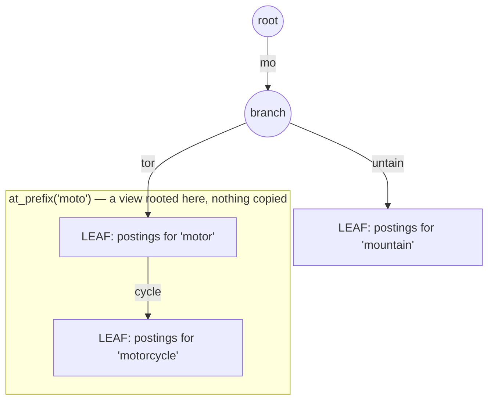

# Overview

`MiniFTS::SearchableMap` is the inverted index's substrate: a radix tree
(compressed prefix trie) that behaves like a `Map` but also answers `at_prefix`
and `fuzzy_get`. It is exported for standalone use (see the README).

# Structure

Each node is a plain Hash. Its keys are edge labels — the compressed path
fragments — and the reserved empty-string key `LEAF = ""` holds the value stored
*at* that node. Path compression means a chain with no branches collapses into a
single edge, so `"motorcycle"` and `"motor"` share one edge until they diverge.
That is what makes prefix search cheap: `at_prefix("moto")` walks to the
divergence node and returns a *view* rooted there rather than copying entries.

Edge labels are the compressed fragments — Hash keys on the parent node — and
`LEAF` (the empty-string key) is where a node's own value lives. `"motor"` and
`"motorcycle"` share the walk down to `B`; only `"cycle"` distinguishes them.

# Two fidelity-critical behaviours

- **Iteration order is contractual.** `each` / serialization runs a DFS that visits
  a node's children with `keys.reverse_each` — chosen so the emitted key order
  matches the JavaScript `SearchableMap`'s insertion-ordered `Map`. That equality
  is *why* serialized indexes are byte-interchangeable
  ([bit-for-bit-fidelity](/decisions/bit-for-bit-fidelity.md)); changing the
  traversal would silently break interop. The one place this equality breaks is
  astral-plane characters (above U+FFFF): edges split on UTF-8 code points here
  vs UTF-16 code units in JS, so those terms serialize in a different order — a
  known boundary the [interchange suite](/porting/interchange-suite.md) maps,
  harmless to loading and search.
- **Fuzzy is a shared-matrix Levenshtein walk.** `fuzzy_get` runs a Levenshtein DP
  over the tree, reusing one edit-distance matrix across the recursion instead of
  recomputing per candidate. Its out-of-bounds handling is one of the subtler
  [porting gotchas](/porting/js-fidelity-gotchas.md#fuzzy-matrix-out-of-bounds).

# Allocation-tuned hot paths

`create_path` and `fuzzy_recurse` are the engine's hottest loops, so they avoid the
throwaway one-character Strings that `key[pos]` and `k[0]` allocate: edge scans
prefilter on `getbyte` and confirm the character in place with `start_with?`, and the
fuzzy walk compares in integer codepoint space via `each_codepoint`. These are
deliberate, allocation-driven divergences from a naive port — byte-identical in
result, and the reason a reader finds `getbyte` where they expect character indexing.
See [allocation-tuning](/benchmarks/allocation-tuning.md).

# Citations

[1] `lib/minifts/searchable_map.rb` — `LEAF`, `dfs` (`keys.reverse_each`), `fuzzy_search` / `fuzzy_recurse`.
