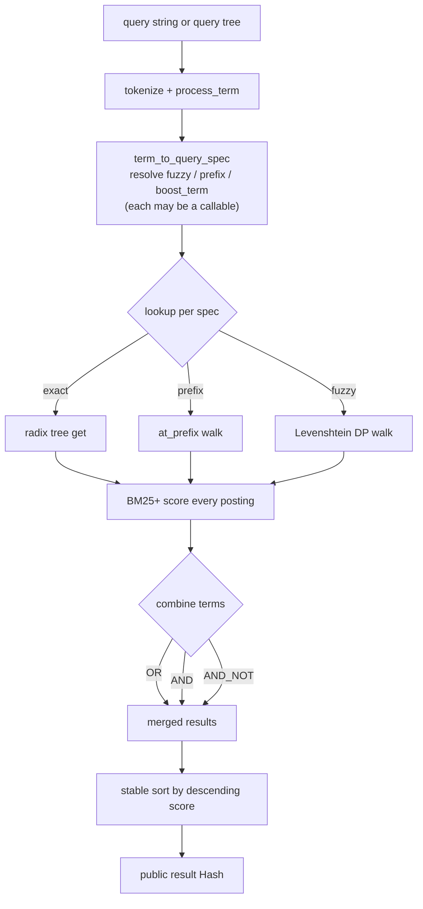
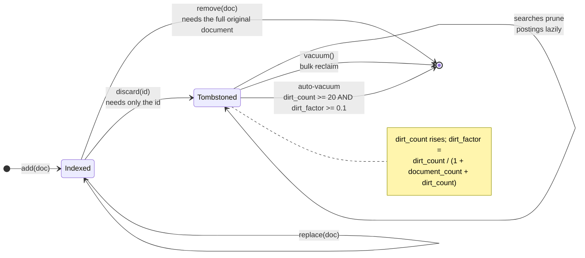

# Overview

`MiniFTS` (in `lib/minifts.rb`) is the engine. It owns the forward maps
(document → stored fields, per-field lengths, averages) and delegates the inverted
index to a [radix tree](/architecture/radix-tree-index.md) per field. The API is
in the README; what follows is the design that isn't visible there.

# The search pipeline

A query resolves through a small pipeline: tokenize → per-term
`term_to_query_spec` (resolving `fuzzy` / `prefix` / `boost_term`, each of which
may be a callable) → look each spec up in the radix tree (exact, prefix walk, or
Levenshtein) → [BM25+ score](/architecture/bm25-scoring.md) every posting →
combine terms with `OR` / `AND` / `AND_NOT` → stable sort by descending score.
Queries can also be combination *trees*, recursed the same way. Cost scales with
the number of *matching* documents, not the corpus size — the reason the engine
stays fast as the corpus grows, and why it
[outruns a linear scan by ~50×](/benchmarks/okf-vs-minifts.md) in practice.

The three lookup branches all feed the same scorer, and every branch's cost is
paid per *match*, not per document — the shape of the whole performance argument.

The per-document record accumulated as that pipeline runs — running score, matched
query terms, per-term field hits — is carried as a **positional Array**
`[score, terms, match]`, not a symbol-keyed Hash: it is transient (assembled per
posting, merged by the combinators, transcribed into the public result Hash in
`search`) and was the single largest search allocation. The *public* result stays a
Hash; this is an internal, allocation-driven shape only, one of several such wins in
[allocation-tuning](/benchmarks/allocation-tuning.md).

# The dirt model: why discard is lazy

`remove` needs the full original document (to reverse exactly what indexing did);
`discard` needs only the id. `discard` gets away with the id alone by tombstoning
it and *deferring* the index cleanup — posting entries for tombstoned ids are
pruned lazily during later searches and reclaimed in bulk by `vacuum`. The engine
tracks a `dirt_count` of tombstoned documents and a `dirt_factor`
(`dirt_count / (1 + document_count + dirt_count)`); once **both** cross their
thresholds — `dirt_count >= 20` *and* `dirt_factor >= 0.1` by default —
**auto-vacuum** runs on the caller's behalf. The absolute-count floor is what
stops a tiny index from vacuuming on its first discard, where the ratio alone
would trigger immediately. This is why `discard` is the ergonomic default and
`remove` the exact-but-demanding counterpart.

Vacuuming is **synchronous** by deliberate divergence from JS
([bit-for-bit-fidelity](/decisions/bit-for-bit-fidelity.md#deliberate-divergences)):
Ruby has no UI main thread to protect, so the async / batched variants are dropped.

# Citations

[1] `lib/minifts.rb` — `dirt_factor` (`@dirt_count.fdiv(1 + @document_count + @dirt_count)`), `calc_bm25_score`, `sort_by_score`.
[2] `lib/minifts.rb` — `DEFAULT_VACUUM_CONDITIONS = { min_dirt_factor: 0.1, min_dirt_count: 20 }` and `vacuum_conditions_met?` (the conjunction the auto-vacuum edge asserts).
[3] `README.md` §"Adding, removing, and updating documents".
