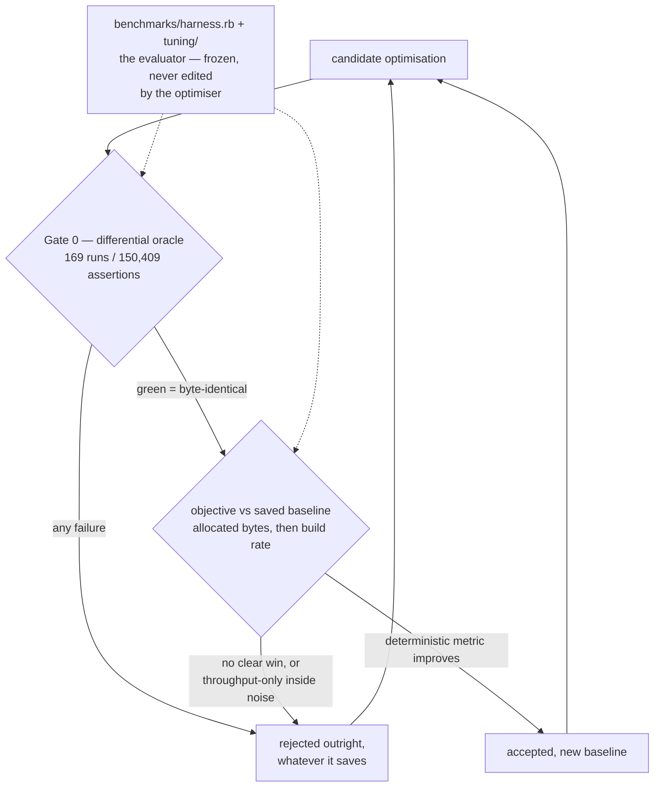

# Overview

minifts's hot paths were tuned in a deliberate campaign, not by guesswork: a run
of small allocation-cutting changes to the
[search engine](/architecture/search-engine.md) and
[radix tree](/architecture/radix-tree-index.md), each kept only if it left the output
*byte-identical* to JavaScript and measurably leaner. The engine now indexes and
searches on a fraction of the memory churn it began with, at higher throughput, with
the [differential oracle](/porting/differential-oracle.md) proving behaviour never
moved.

# The harness: a frozen evaluator

The loop borrows karpathy's *autoresearch* shape — an accept/reject loop around an
evaluator the optimiser may never edit. `benchmarks/harness.rb` is that evaluator and
`benchmarks/tuning/` holds its frozen corpus and contract. It judges a candidate
lexicographically:

1. **Correctness is a hard gate, not a score.** Gate 0 is the full
   [differential suite](/porting/differential-oracle.md) — 169 runs / 150,409
   assertions. A change that fails it is rejected outright, whatever it saves. Because
   the suite is a JS oracle, green means *byte-identical*, so performance is optimised
   **under a frozen correctness spec** — the payoff of
   [bit-for-bit fidelity](/decisions/bit-for-bit-fidelity.md) turned into a tuning
   harness.
2. **Then, and only then, performance.** Allocated bytes (indexing and search) and
   build rate form the objective, scored against a saved baseline.

# What the objective must be measured on

The load-bearing lesson: **memory metrics are trustworthy, throughput is not.**
Allocated bytes are deterministic to ~0.1 % run-to-run; query throughput drifts
±3–10 % on the same laptop. So a change is accepted only when a *deterministic*
metric improves clearly — throughput moving inside its noise band can manufacture a
false win and never justifies a commit on its own.

# The pattern that generated every win

Almost every accepted change killed the same waste: **Ruby allocates a throwaway
one-character String for `str[i]` and `k[0]`.** In the tightest loops — the radix
tree's edge scans and the Levenshtein fuzzy walk, run per character per candidate —
that churn dominates. The fixes swap character indexing for allocation-free
equivalents: `getbyte` byte-prefilters, integer `codepoints` / `each_codepoint`
comparison, `start_with?` first-character confirmation. A separate structural win
carries the per-document search result as a positional Array instead of a
symbol-keyed Hash. None of it changes a single output byte.

# Results

Measured on the real `@okf` corpus (scaled by replicating real bodies), before
(`e7ef7b4`, pre-campaign) versus after (`47ca11c`), output verified identical across
2,627 result rows:

| workload | before | after | change |
|----------|--------|-------|--------|
| indexing throughput | 362 docs/s | 496 docs/s | **+37 %** |
| indexing allocation | 451 MB | 106 MB | **−77 % (4.3× lighter)** |
| search throughput | 152 q/s | 174 q/s | **+15 %** |
| search allocation | 70 MB | 39 MB | **−45 % (1.8× lighter)** |

The memory wins dwarf the speed wins because Ruby's allocator is cheap per object;
what 4× less allocation buys is far lower GC pressure and transient footprint — which
is what matters for an in-memory index. Indexing, which was allocation-bound
(≈11.5 M objects to index 500 docs, now ≈2.4 M), carries its memory win into speed.

# Citations

[1] `benchmarks/harness.rb`, `benchmarks/tuning/` — the frozen evaluator, corpus, and contract.
[2] Real-corpus differential (Ruby 4.0.5, 2026-07-17), `e7ef7b4` → `47ca11c`: indexing 362→496 docs/s and 451→106 MB; search 152→174 q/s and 70→39 MB; 2,627 result rows byte-identical.
[3] Git range `e7ef7b4..47ca11c` — the seven optimisation commits.
