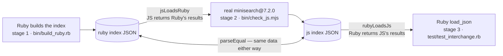

# Overview

Where the [differential oracle](/porting/differential-oracle.md) proves *search
results* match in one direction (JS generates fixtures, Ruby replays them), this
suite proves the *serialized index itself* interchanges in **both** directions —
the "materialize once, serve both" use case behind
[bit-for-bit fidelity](/decisions/bit-for-bit-fidelity.md) and
[MiniFTS's role in okf](/decisions/minifts-role-in-okf.md): build the index
in the Ruby backend, ship the JSON, load it in the JavaScript frontend (or the
reverse). It runs 32 scenarios of escalating complexity through the Ruby port and
the *real* `minisearch@7.2.0` npm package, via `rake compat` (kept out of `rake
test` so the pure-Ruby 2.4 floor stays Node-free).

# What it asserts

Per scenario, three invariants — all green across all 32, both directions:

- **jsLoadsRuby** — JS `loadJSON`s the Ruby index and returns Ruby's search results.
- **rubyLoadsJs** — Ruby `load_json`s the JS index and returns JS's results.
- **parseEqual** — the two serialized indexes carry the same data (order- and
  number-spelling-independent).

Results match to 10 decimal places; **31/32 are also byte-for-byte identical**.

# What it surfaced

The byte-level comparison caught two serializer gaps the oracle's *parsed* golden
comparison could not see — both now fixed in `to_json`, both catalogued as
[fidelity gotchas](/porting/js-fidelity-gotchas.md): whole-valued
`averageFieldLength` spelled `4.0` vs JS's `4`, and per-term field-id keys emitted
in Hash-insertion order vs JS's ascending integer-key order.

The **one** remaining non-byte-identical scenario is astral-plane characters
(above U+FFFF, e.g. most emoji): the [radix tree](/architecture/radix-tree-index.md)
splits edges on UTF-8 code points where JS splits on UTF-16 code units, so their
serialized *term order* differs. This is fundamental to the two languages' string
model and is left as-is — it does not affect loading or search (the scenario still
passes every functional invariant), only the byte order.

# Operational note: vacuum before materializing

A discarded-but-not-vacuumed index carries dirt (postings for removed documents).
Serializing and reloading such an index yields *different* (dirt-skewed) BM25
scores than the live index — **identically in both engines**, so it is a property
of dirty serialization, not an incompatibility. Call `vacuum` (Ruby) /
`await vacuum()` (JS) before serializing a [materialized index](/architecture/search-engine.md)
for stable scores; the suite's `after_vacuum` scenario confirms the clean path is
fully equivalent.

# Citations

[1] `fidelity/` — `scenarios/` (catalog + custom twins), `bin/build_ruby.rb`,
    `bin/check_js.mjs`, `test/test_interchange.rb`; run with `rake compat`.
[2] `lib/minifts.rb` — `to_json` (whole-float and field-id-order normalization).
[3] `fidelity/README.md` — the invariants, boundaries, and scenario catalogue.
